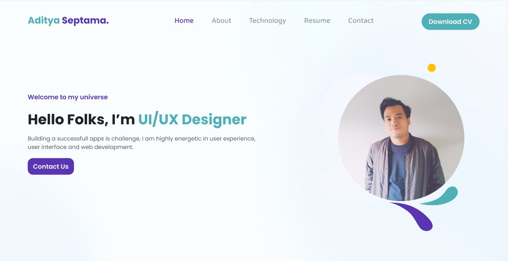

# Aditya Septama Site with NEXT JS, Boostrap 5, And TypeScript

🚀 Website portofolio Starter with Next.js, Boostrap CSS and TypeScript ⚡️ Made with developer experience first: Next.js, TypeScript, ESLint, Prettier, Husky.

<p align="center">
    
</p>

### Philosophy

- Minimal code
- 🚀 Production-ready

### Requirements

- Node.js 14+ and npm

1. Initialize your project with this command:

### How do I get set up?

Run the following command on your local environment:

```shell
git clone https://github.com/adityamo/aditsite-nextjs.git
cd my-project-name
npm install
```

Then, you can run locally in development mode with live reload:

```shell
npm run dev
```

Open http://localhost:3000 with your favorite browser to see your project.

### Deploy to production

You can see the results locally in production mode with:

```shell
$ npm run build
$ npm run start
```

You can create an optimized production build with:

```shell
npm run build-prod
```

Now, your Apps is ready to be deployed. All generated files are located at `out` folder, which you can deploy with any hosting service.

### VSCode information (optional)

If you are VSCode users, you can have a better integration with VSCode by installing the suggested extension in `.vscode/extension.json`. The starter code comes up with Settings for a seamless integration with VSCode. The Debug configuration is also provided for frontend and backend debugging experience.

With the plugins installed on your VSCode, ESLint and Prettier can automatically fix the code and show you the errors. Same goes for testing, you can install VSCode Jest extension to automatically run your tests and it also show the code coverage in context.

Pro tips: if you need a project wide type checking with TypeScript, you can run a build with <kbd>Cmd</kbd> + <kbd>Shift</kbd> + <kbd>B</kbd> on Mac.

Made with ♥ by [AdityaSeptama]
